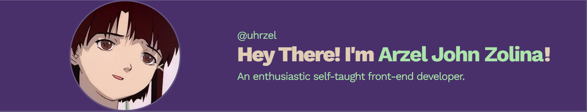

  

  

- 🌱 I’m currently learning **MERN STACK DEVELOPMENT**

- 👨‍💻 All of my projects are available at [my portfolio.](https://portfolio-ajrz.vercel.app/)

- 📫 How to reach me **Arzeljrz17@gmail.com**

- 📄 Know about my experiences [resume.](https://resum-arzeljrz.vercel.app/)

<h3 align="left">Connect with me:</h3>

